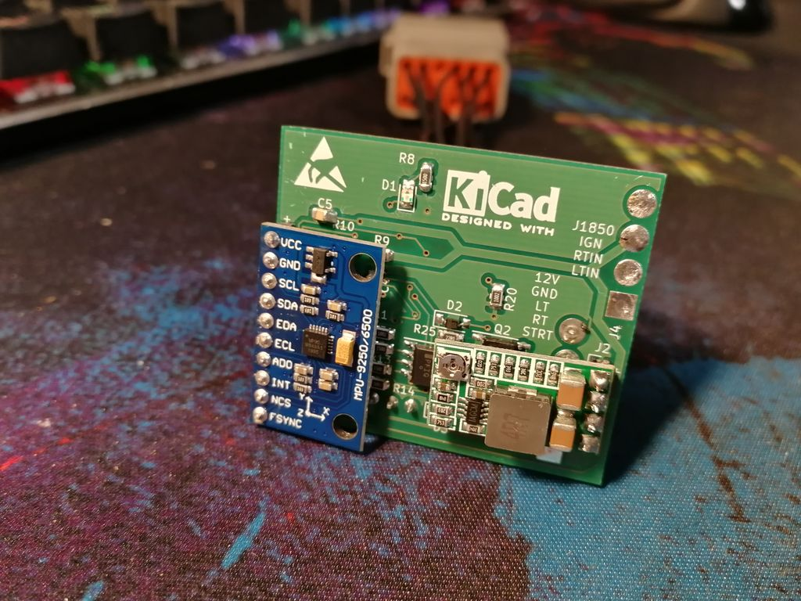

# STM32 TSM for Harleys

This project provides a custom replacement for the stock TSM on Harley motorcycles.  
The firmware is designed to work with the 2004 Sportster model, but may also be compatible with other Harleys from the same generation.  
Refer to  [Sportsterpedia](http://sportsterpedia.com/doku.php) for more information.  

## Description

It's a custom PCB, firmware for *STM32F103* and 3D enclosure model to build your own TSM. Firmware is to be build with GCC.
The project consists of a custom PCB, firmware for the STM32F103 microcontroller, and a 3D enclosure model. The firmware is built using GCC.

## Features

* Customizable settings for halogen and LED bulbs
* Modern accelerometer for improved sensing of turns and movement
* Automatic blinker control
* Hazard lights enable in case of emergency braking

## Status

Please note that this project is a work in progress. The J1850 transfer is not yet tested, and the TSM password store is not yet implemented.

## Building the Firmware

You will need arm-none-eabi and GNU make installed on your system to complete the build. Basic git usage is also required to clone the repo.
To build the firmware, navigate to the root folder of the project and issue the following command:

make

## PCB Board

The PCB, gerber files, and schematic are located in the corresponding folders.

## Enclosure

STL files for 3D printing the enclosure are also available. The model was printed using PETG with 0.3mm layers.

## How to Use

Instructions for using the TSM once it's been built will be added later.
If you have any questions or feedback, please feel free to contact me.

