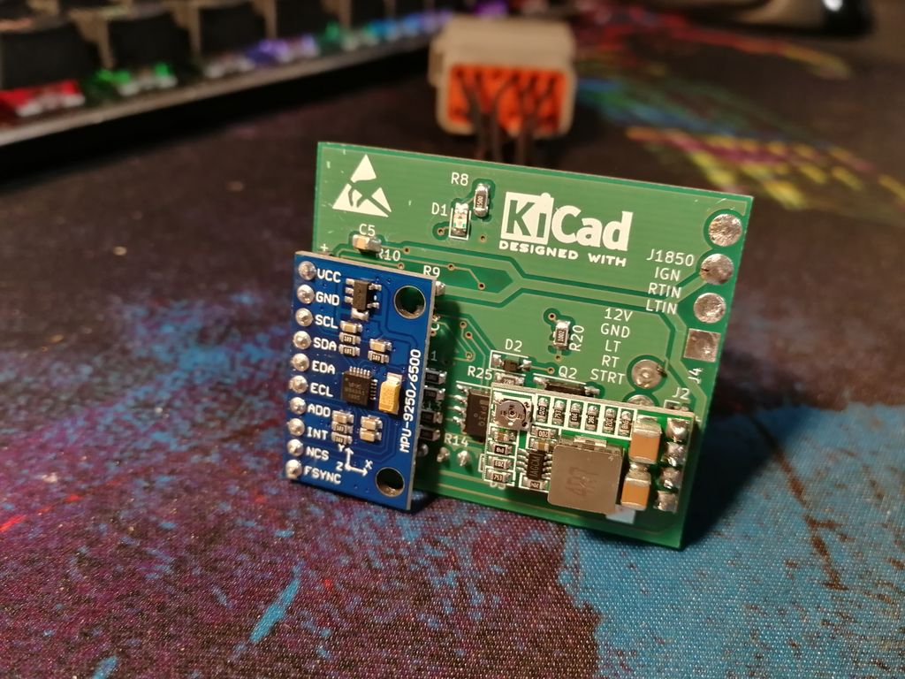

# STM32 TSM for Harleys

A replacement Turn Signal Module (TSM) for Harley-Davidson motorcycles.
Developed against the 2004 Sportster; likely compatible with other Harleys of
the same generation. See [Sportsterpedia](http://sportsterpedia.com/doku.php)
for background.

## Contents

- Custom PCB (gerbers and schematic in the corresponding folders)
- Firmware for the STM32F103, built with GCC
- 3D-printable enclosure (STL files; reference print in PETG, 0.3 mm layers)

## What the firmware does

- Turn-signal control: left/right, automatic cancel, and turn detection via an
  MPU-9250 IMU (DMP orientation)
- Hazard lights, including automatic activation on hard braking
- Halogen and LED bulb support with per-bulb PWM settings
- J1850 VPW bus receive and transmit (see [docs/J1850_bus.md](docs/J1850_bus.md))
- Decodes bus signals: RPM, speed, gear/neutral/clutch, engine temperature,
  odometer, fuel, MIL and security-lamp state, and KWP2000 DTCs
- TSM/TSSM emulation so the instrument cluster, ECM and BCM see a live module at
  address 0x40: presence broadcasts, the 0x92 security handshake, and automatic
  DTC clearing (keeps the check-engine and security lamps off)
- J1850-based starter lock (starter disabled while the bike is moving)
- Reset-cause and bus tracing over SEGGER RTT

## Status

Work in progress. J1850 receive/transmit and TSM emulation are implemented and
tested on a bike. A user-configurable TSM security PIN store is not implemented.

## Building

Requires `arm-none-eabi` and GNU make. From the project root:

    make

## Configuration

Build- and pin-level options are in [Core/Inc/settings.h](Core/Inc/settings.h).
