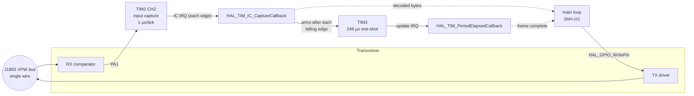
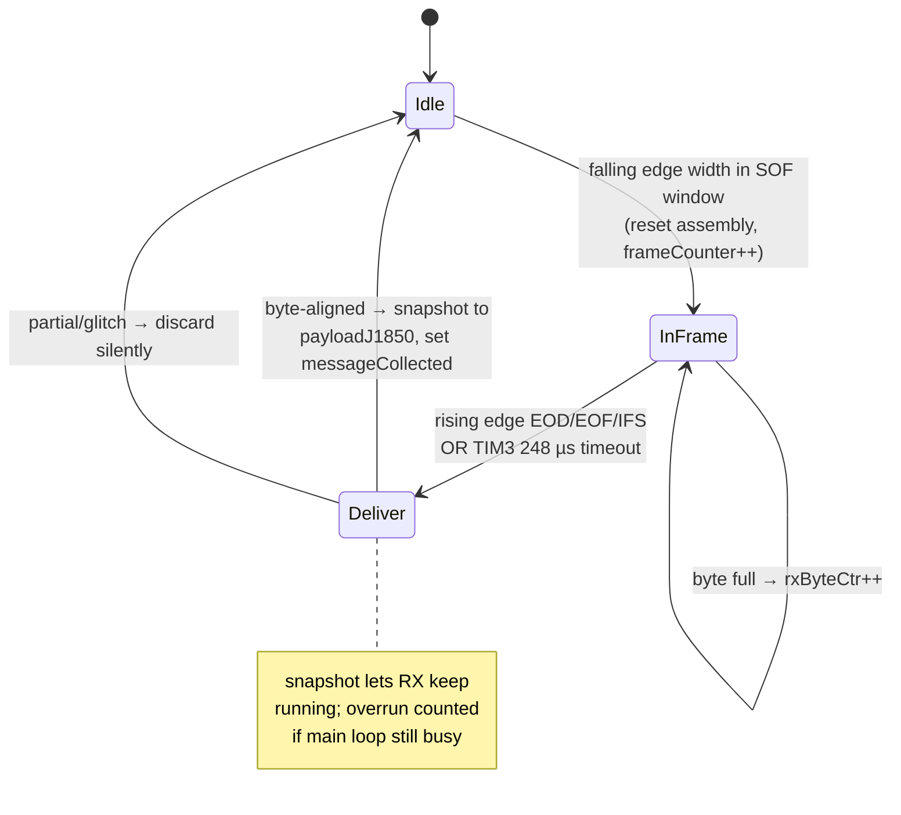
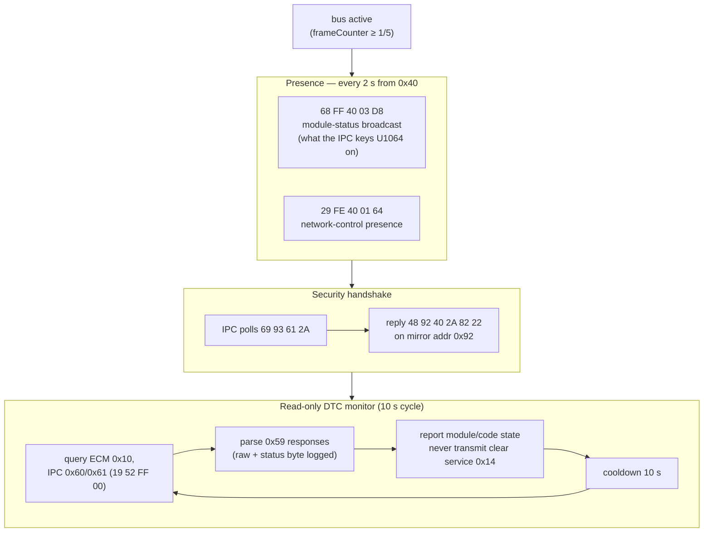
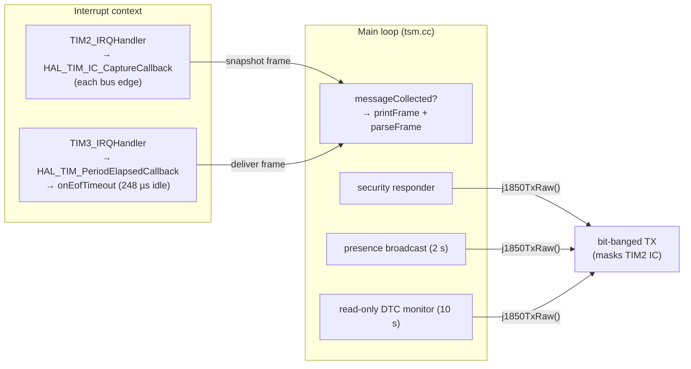

# TSM J1850 VPW Bus — Functional Description

This document describes how the TSM firmware receives, decodes, transmits and
acts on **SAE J1850 VPW** traffic on a Harley‑Davidson Delphi bus, and how it
emulates a TSM/TSSM so the instrument cluster, ECM and BCM see a healthy module
at address `0x40`.

Source files:

| File | Role |
|------|------|
| [`Core/Inc/j1850.h`](../Core/Inc/j1850.h) | Public API, timing constants, header/union types, decoded signal globals |
| [`Core/Src/j1850vpw.cc`](../Core/Src/j1850vpw.cc) | Physical layer: RX edge decode ISR, bit‑banged TX, carrier‑sense, arbitration, CRC |
| [`Core/Src/j1850parser.cc`](../Core/Src/j1850parser.cc) | Frame parse/decode, DTC handling, human‑readable trace |
| [`Core/Src/tsm.cc`](../Core/Src/tsm.cc) | Application: presence heartbeat, security responder, read-only DTC monitor |
| [`Core/Src/switch_ctrl.cc`](../Core/Src/switch_ctrl.cc) | TIM3 EOF one‑shot ISR |
| [`Core/Inc/settings.h`](../Core/Inc/settings.h) | Timer/pin bindings, feature flags |

---

## 1. Physical layer at a glance

J1850 VPW is a **single‑wire, variable‑pulse‑width, CSMA/CR** bus. Bits are
encoded as the *time between edges*, and the *level* (active/passive) alternates
every symbol. A "1" and a "0" are distinguished purely by pulse width, and the
meaning of a given width flips depending on whether the current symbol is active
or passive (VPW's defining trick).

| Symbol | Nominal width | Meaning |
|--------|--------------:|---------|
| Short pulse | 64 µs | active→`1` / passive→`0` |
| Long pulse | 128 µs | active→`0` / passive→`1` |
| SOF (Start of Frame) | 200 µs active | frame begins |
| EOD (End of Data) | 200 µs passive | data block ends (before IFR) |
| EOF (End of Frame) | 280 µs passive | frame ends |
| IFS (Inter‑Frame Sep.) | ≥ 300 µs passive | bus idle, next node may start |

RX acceptance windows (`j1850.h`) are widened around these nominals
(`RX_SHORT_MIN..MAX`, `RX_LONG_MIN..MAX`, `RX_SOF_MIN..MAX`, …).

### Hardware bindings (`settings.h`)

```
TIM2 CH2  (PA1, J1850RX)  input capture, 1 µs/tick  — RX edge timing
TIM3      (248 µs one‑shot)                         — EOF idle detector
PA2       (J1850TX)       GPIO push‑pull output     — bit‑banged TX
DWT->CYCCNT                                          — sub‑µs TX bit timing / carrier sense
```



---

## 2. Receive path

### 2.1 Edge capture and VPW decode

`TIM2_CH2` is armed for input capture and its polarity is **flipped after every
edge**, so the ISR alternately sees rising and falling edges. Each edge's
timestamp minus the previous one is the pulse width, which is classified into a
symbol. The counter runs free at 1 µs/tick; pulse math uses 16‑bit modulo
subtraction so a counter wrap between two edges of a legal (< 65.5 ms) symbol is
handled without aborting the frame.

- **Falling edge** ends an *active* symbol (`onFallingEdge`): classify as SOF, or
  active‑`0`/active‑`1`, and write the bit into the live assembly buffer.
- **Rising edge** ends a *passive* symbol (`onRisingEdge`): classify as
  EOD/EOF/IFS (frame terminators) or passive‑`0`/passive‑`1` data bit.

Bits accumulate MSB‑first into `rxAssembly[rxByteCtr]`; every 8 bits advance
`rxByteCtr`. A frame larger than the 64‑byte buffer resets the live assembly.

### 2.2 EOF detection and frame delivery

After each falling edge the ISR (re)arms the **TIM3 248 µs one‑shot**. If no
further edge arrives within that window, the bus has gone idle → TIM3's update
IRQ calls `onEofTimeout()` → `deliverCompletedFrame()`. A rising‑edge classified
as EOD/EOF/IFS delivers the frame the same way.

`deliverCompletedFrame()` **snapshots** a byte‑aligned frame from the ISR‑private
`rxAssembly` into the shared `payloadJ1850[]` / `j1850RXctr`, sets
`messageCollected`, and immediately re‑arms the live assembly. Reception
therefore continues into the next frame while the main loop is still parsing the
previous one; frames that complete before the main loop drains the snapshot bump
`j1850DroppedFrames` (RX overrun counter) instead of corrupting it.



### 2.3 Frame parsing (`parseFrame`)

The main loop, on `messageCollected`, calls `printFrame()` (trace) then
`parseFrame()`:

1. **Length / CRC check** — reject empty or > 12‑byte frames; verify the trailing
   CRC‑8 (`crc1850`, polynomial `0x1D`, init `0xFF`, final XOR).
2. **Header** — byte 0 is the 3‑bit priority + type bits; a 1‑byte‑header frame
   (`type`=1) is rejected (this network uses 3‑byte headers: `[hdr][dest][src]`).
3. **Dispatch by destination** (byte 1) into decoders that populate the global
   signal state consumed elsewhere in the firmware:

| Dest | Frame | Decoded into |
|------|-------|--------------|
| `0x1B` RPM | `28 1B 10 02 hi lo` | `rpms = (hi<<8\|lo)/4` |
| `0x29` Speed | `48 29 10 02 hi lo` | `kph = (hi<<8\|lo)/128` |
| `0x88` MIL | `xx 88 10 ..` | `mil` (pri 3) / `milAux` (other) |
| `0x89` SIL | `xx 89 61 ..` | `sil` (pri 6) / `silAux` (pri 7) |
| `0xDA` Turn | `48 DA 40 39 xx` | `turn_signals` |
| `0x3B` Gear | `48 3B 40 xx` / `a8 3B 10 03 xx` | `in_neutral`, `clutch_engaged`, `gear_num` |
| `0x49` Temp | `a8 49 10 10 xx` | `engine_temp_f` |
| `0x83` Fuel | `a8 83 10 0a hi lo` / `..61 12 dx` | `fuel_ticks`, `fuel_gauge_level` |
| `0x69` Odo | `a8 69 10 06 hi lo` | `trip` (delta‑accumulated) |
| `0x93` Security | `69 93 61 2A ..` | flags `securityPollPending` |
| `0x59` service | `6C F1 <src> 59 ..` | KWP DTC response → decode + flags |

RPM and speed are accepted only from exact seven-byte ECM (`0x10`) subtype
`0x02` frames, including the CRC byte. The RPM/KPH signals feed the J1850
engine‑state starter lock
([`engine_state.cc`](../Core/Src/engine_state.cc)). The release configuration
locks as soon as RPM reaches 700; the 10 km/h threshold independently marks the
`Moving` state. The DTC/security state drives the auto‑DTC FSM and lamp
behaviour.

Fresh J1850 engine state is authoritative for the daytime running lights:
`Running` or `Moving` enables them and a continuously qualified `Off` state
disables them. When telemetry is stale or unavailable, voltage is the fallback:
an 8-sample noise filter, 15 seconds continuously above the high threshold to
enable, and 5 minutes continuously below the low threshold to disable. Returning
to the middle band resets both qualification timers, preserving the intended
red-light-stop guard without adding roughly two minutes of filter lag.

---

## 3. Transmit path

TX is **bit‑banged** on PA2, timed by `DWT->CYCCNT`. Every application TX goes
through `j1850TxRaw()`, which returns `true` only if the frame actually reached
the bus (failures are logged, not silent).

```mermaid
sequenceDiagram
    participant APP as main loop
    participant TX as j1850TxRaw()
    participant SF as sendFrame()
    participant BUS as bus

    APP->>TX: bytes[], len
    TX->>TX: waitBusIdle()  (≥280 µs passive, ≤20 ms, IC still armed)
    alt bus never idle
        TX-->>APP: false  ("bus busy, not sent")
    else idle
        TX->>TX: stop input capture, messageReset()
        TX->>SF: sendFrame(bytes, len)
        SF->>SF: crc = crc1850(bytes,len); waitBusIdle()
        SF->>BUS: drive SOF (200 µs active)
        loop each byte + CRC
            SF->>BUS: bit‑bang symbols
            SF->>SF: during passive symbol, sample RX;<br/>persistent active ⇒ LostArbitration
        end
        SF->>BUS: EOF/EOD passive
        alt LostArbitration
            TX->>TX: wait idle, retry ONCE (arb monitor disabled)
        end
        TX->>TX: restart input capture
        TX-->>APP: OK / LOST_ARB (logged)
    end
```

Key robustness features:

- **Carrier sense** (`waitBusIdle`) — refuse to start a frame until the bus has
  been passive for ≥ 280 µs (just under `RX_IFS_MIN`), so we don't stomp another
  node. The input capture stays armed during the wait so a frame arriving
  mid‑wait is still received, not destroyed.
- **CSMA/CR arbitration** — while driving a *passive* symbol, the RX line is
  sampled; a foreign *active* level that persists past a 32 µs blanking window
  (to ignore our own transceiver slew) for ≥ 8 µs means we lost arbitration and
  yield immediately, so the other node's frame survives.
- **Monitored retry** — a `LostArbitration` triggers one bounded retry after the
  bus returns idle. Arbitration monitoring remains enabled on every attempt, so
  a second collision is detected instead of corrupting both frames.
- **RX masking** — the input capture is stopped and RX state reset for the
  duration of our own bit‑banging so we don't decode our own pulses.

---

## 4. TSM/TSSM emulation (application layer)

The bike expects a module at address `0x40`. When it's absent, the IPC stores
`U1064`/`U1255` (Loss of TSM Serial Data) and flashes the security lamp, and the
ECM can flag `P1009`/`P1010` (password). The firmware emulates a live TSM by
speaking three things a genuine module puts on the bus (all confirmed against
real captures and CRC‑verified):



- **Presence** — the module‑status broadcast `68 FF 40 03` (parallels the ECM's
  `68 FF 10 03`, IPC's `68 FF 61 03`, HUD's `68 FF 62 03`) plus the
  network‑control `29 FE 40 01`. The first goes out immediately on bus wake‑up
  (the IPC's presence deadline is only ~3 s) and a failed TX retries in 250 ms.
- **Security responder** — the IPC's `69 93 61 2A` poll to security function
  `0x93` is answered on the mirror address `0x92` with `48 92 40 2A 82 22`, the
  reply a real TSM sends (donor capture). After one reply the IPC stops polling
  and the security lamp stays off.
- **Read-only DTC monitor** — cycles every 10 s: query ECM/IPC for stored codes
  and decode the `0x59` responses (logging raw bytes + the KWP status byte that
  distinguishes current vs historic). It never transmits service `0x14`; DTC
  clearing is reserved for an explicit external service-tool action.

> **Note — password learn:** for a *TSM‑replacing‑TSM* install the H‑D service
> procedure requires **no** password learn, so the emulation targets the
> serial‑data‑loss (`U1064`/`U1255`) and presence mechanism, not the ECM password
> handshake.

---

## 5. Interrupt & timer summary



| Timer | Config | Purpose |
|-------|--------|---------|
| TIM2 | prescaler 63 @ 64 MHz → 1 µs/tick, CH2 input capture, polarity flipped per edge | RX edge timing |
| TIM3 | prescaler 63, period 247 → 248 µs one‑shot | EOF / bus‑idle detection |
| DWT CYCCNT | core cycle counter | TX bit timing, carrier sense, arbitration |

---

## 6. Decoded signal reference

Globals exported by `j1850.h`, populated by `parseFrame()` and consumed across
the firmware:

`rpms`, `kph`, `mil`/`milAux`, `sil`/`silAux`, `dtc`, `trip`, `gear_num`,
`in_neutral`, `clutch_engaged`, `turn_signals`, `engine_temp_f`, `fuel_ticks`,
`fuel_gauge_level`, plus diagnostic flags `passwordDtcSeen`, `ecmSeen`,
`bcmDtcSeen`, `ipcDtcSeen`, `securityPollPending`, and counters `frameCounter`,
`j1850RXctr`, `j1850DroppedFrames`, `messageCollected`.
