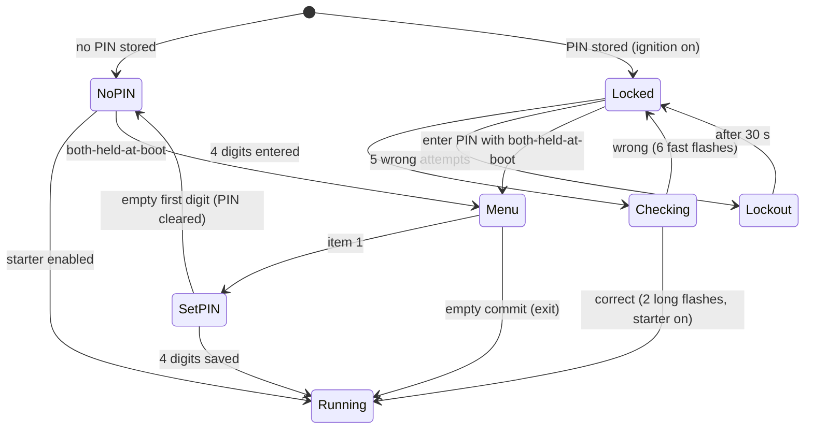

# Security PIN — User Manual

The TSM includes an optional **starter immobilizer**. When a PIN is set, the
starter stays disabled after you switch the ignition on until you enter the PIN
on the **turn-signal buttons**. Everything else on the J1850 bus keeps working
during entry, so the instrument-cluster lamps behave normally.

There is no keypad — the **left and right turn-signal switches are the keypad**,
and the **turn-signal lamps are the display**. Watch the lamps: they confirm
every press and tell you whether the PIN was accepted or rejected.

---

## At a glance

| Gesture | Action |
|---|---|
| Press **LEFT** *N* times, then **RIGHT** once | Enter one digit of value *N* (1–9) |
| Enter all 4 digits | Submit the PIN |
| Tap **BOTH** buttons together (briefly) | Abort and restart the current entry |
| Hold **BOTH** buttons ≥ 1 s | Toggle hazard lights (works even while locked) |
| Hold **BOTH** buttons while switching ignition **ON** | Enter the settings menu |

| Lamp signal | Meaning |
|---|---|
| One short blip on the side you pressed | Press counted |
| Short blip on the right | Digit committed |
| **Both lamps flash fast ×6** | **Wrong PIN / invalid input — start over** |
| **Both lamps: two long flashes** | Accepted — starter enabled |
| Both lamps blip once every ~2 s | Locked out (too many wrong tries) |
| Security lamp on the cluster pulsing | Immobilizer armed, waiting for the PIN *(experimental — see note)* |

---

## Entering a digit

A PIN is **4 digits**, each from **1 to 9** (there is no zero digit).

To enter a digit:

1. Press the **LEFT** button once for each unit of the digit's value. Each press
   gives a short blip on the **left** lamp, so you can count along — three
   presses for a `3`, seven for a `7`.
2. Press the **RIGHT** button once to commit that digit. The **right** lamp
   blips to confirm.

Repeat for all four digits. After the fourth digit commits, the TSM checks the
PIN automatically — you do **not** press anything extra to submit.

> **Miscounted?** Tap **both** buttons together briefly to abort and start the
> whole entry from the first digit.

### Example — PIN `2 4 8 3`

```
LEFT LEFT                RIGHT     → digit 2
LEFT LEFT LEFT LEFT      RIGHT     → digit 4
LEFT ×8                  RIGHT     → digit 8
LEFT LEFT LEFT           RIGHT     → digit 3   → PIN checked
```

---

## Correct vs. incorrect PIN

- **Correct:** both turn lamps give **two long flashes** and the starter is
  enabled. Normal turn-signal operation resumes.
- **Incorrect:** both turn lamps **flash rapidly six times** and the entry
  resets to the first digit. The starter stays disabled. Try again.

After **5** wrong PINs the TSM enters a **30-second lockout**: button input is
ignored and both lamps give a single blip about every 2 seconds so you know it
is waiting. When the lockout ends you may try again. (A correct PIN entered
*during* the lockout does nothing — wait for it to clear.)

The inactivity timeout is **15 seconds**: if you start a PIN and then stop, the
partial entry is discarded with the fast six-flash and you begin again.

---

## Settings menu

The menu lets you set, change, or clear the PIN.

1. **Hold both buttons** while you switch the ignition **ON**, and keep holding
   until the lamps respond.
2. If a PIN is already set, you must **enter the current PIN first**; you then
   land in the menu. If no PIN is set, you enter the menu directly (both lamps
   give one long welcome flash).
3. Select a menu item with the same digit gesture — press **LEFT** *N* times,
   then **RIGHT**:
   - **Item 1** — set / change the PIN.
   - **Empty commit** (press **RIGHT** with no left presses) — leave the menu.

The menu closes on its own after 15 seconds of no input.

### Set or change the PIN

1. Enter the menu and choose **item 1** (LEFT once, then RIGHT).
2. Enter the four digits of the **new** PIN exactly as in normal entry. When the
   fourth digit commits, both lamps give the two-long-flash "saved" signal and
   the PIN is stored.

### Clear the PIN (disable the immobilizer)

1. Enter the menu and choose **item 1**.
2. When it asks for the first digit, press **RIGHT** immediately with **no left
   presses** (an empty first digit). Both lamps give the "saved" signal and the
   immobilizer is now **off** — the bike will start without a PIN.

---

## Roadside safety

- **Hazards always work.** Holding **both** buttons for about a second toggles
  the hazard lights, even while the immobilizer is locked and waiting for the
  PIN. Use it before you ever touch the PIN if you need to.
- **A lost PIN is recoverable at the bench,** not on the road: with the firmware
  programming tools you can clear the stored PIN (or re-flash). The PIN lives in
  the microcontroller's flash, so disconnecting the battery does **not** erase
  it and does **not** bypass the lock.
- The immobilizer only holds the **starter** relay. It does not cut a
  running engine.

---

## Behaviour on reset

The starter is also fail-locked after an abnormal reset (watchdog, fault): only
a genuine ignition/power cycle releases it. When a PIN is set, that release
additionally requires the PIN. A watchdog or fault reset while riding keeps the
starter locked until the next real power cycle **and** the PIN — deliberately.

---

## Security-lamp flash *(experimental)*

While the immobilizer is armed and waiting, the firmware also tries to flash the
**security lamp on the instrument cluster** (~1 Hz), the way a factory security
system indicates "armed." Whether the cluster obeys a TSM-driven lamp command is
still being confirmed on real hardware; if it does not flash, the feature is
harmless and the turn-lamp feedback above is unaffected. It can be turned off at
build time (`SECURITY_FLASH_SIL` in `Core/Inc/settings.h`).

---

## Flow



---

## Tunable timings

All in [`Core/Inc/settings.h`](../Core/Inc/settings.h); defaults shown.

| Constant | Default | Meaning |
|---|---|---|
| `SECURITY_PIN_LENGTH` | 4 | number of digits |
| `SECURITY_ENTRY_TIMEOUT_MS` | 15000 | inactivity aborts a partial entry / closes the menu |
| `SECURITY_MAX_ATTEMPTS` | 5 | wrong PINs before lockout |
| `SECURITY_LOCKOUT_MS` | 30000 | lockout duration |
| `SECURITY_DEBOUNCE_MS` | 30 | button debounce during entry |
| `SECURITY_CHORD_HAZARD_MS` | 1000 | both-held time that toggles hazard |
| `SECURITY_SIL_FLASH_MS` | 500 | security-lamp half-period (~1 Hz) |

The PIN itself is stored in flash-emulated EEPROM
([`Core/Src/eeprom.cc`](../Core/Src/eeprom.cc)); a value of 0 means "no PIN set."
